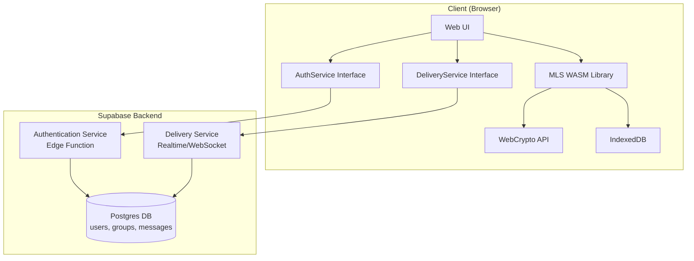
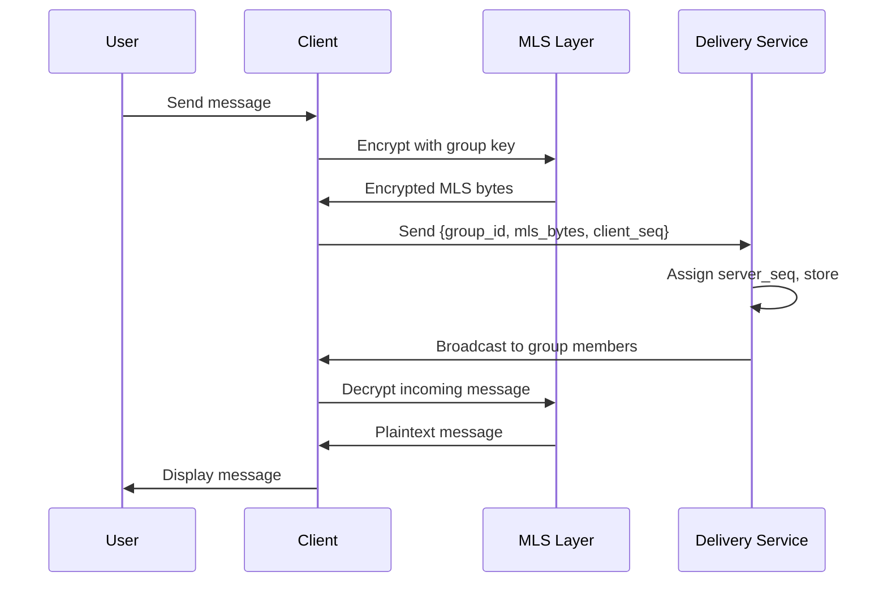
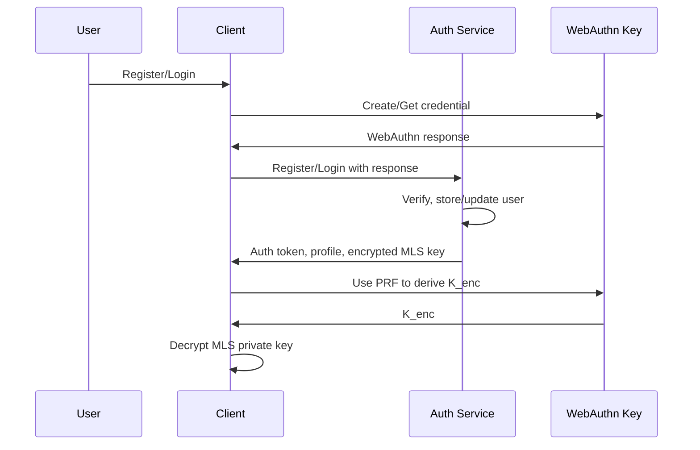
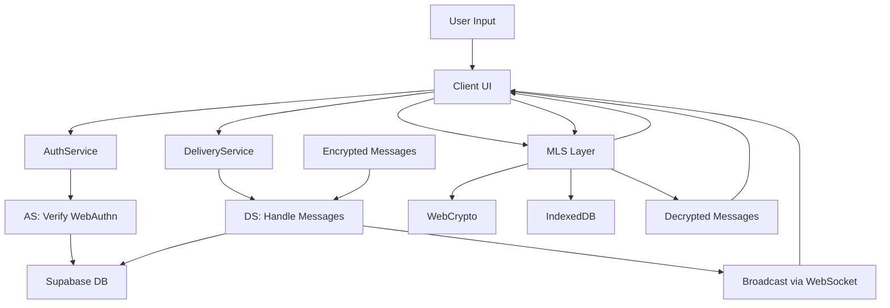

# Architecture Diagrams

This document contains visual diagrams for the MLS-Chat architecture.

## High-Level Architecture

```mermaid
graph TB
    subgraph "Client (Browser)"
        UI[Web UI]
        MLS_WASM[MLS WASM Library]
        WebCrypto[WebCrypto API]
        IndexedDB[IndexedDB]
        AuthSvc[AuthService Interface]
        DelSvc[DeliveryService Interface]
    end

    subgraph "Supabase Backend"
        AS[Authentication Service<br/>Edge Function]
        DS[Delivery Service<br/>Realtime/WebSocket]
        DB[(Postgres DB<br/>users, groups, messages)]
    end

    UI --> AuthSvc
    UI --> DelSvc
    UI --> MLS_WASM
    MLS_WASM --> WebCrypto
    MLS_WASM --> IndexedDB

    AuthSvc --> AS
    DelSvc --> DS
    AS --> DB
    DS --> DB
```

## MLS Flow Diagram

```mermaid
sequenceDiagram
    participant U as User
    participant C as Client
    participant MLS as MLS Layer
    participant DS as Delivery Service

    U->>C: Send message
    C->>MLS: Encrypt with group key
    MLS->>C: Encrypted MLS bytes
    C->>DS: Send {group_id, mls_bytes, client_seq}
    DS->>DS: Assign server_seq, store
    DS->>C: Broadcast to group members
    C->>MLS: Decrypt incoming message
    MLS->>C: Plaintext message
    C->>U: Display message
```

## WebAuthn Flow Diagram

```mermaid
sequenceDiagram
    participant U as User
    participant C as Client
    participant AS as Auth Service
    participant WK as WebAuthn Key

    U->>C: Register/Login
    C->>WK: Create/Get credential
    WK->>C: WebAuthn response
    C->>AS: Register/Login with response
    AS->>AS: Verify, store/update user
    AS->>C: Auth token, profile, encrypted MLS key
    C->>WK: Use PRF to derive K_enc
    WK->>C: K_enc
    C->>C: Decrypt MLS private key
```

## Data Flow Diagram

```mermaid
flowchart TD
    A[User Input] --> B[Client UI]
    B --> C[AuthService]
    B --> D[DeliveryService]
    C --> E[AS: Verify WebAuthn]
    D --> F[DS: Handle Messages]

    E --> G[Supabase DB]
    F --> G

    H[MLS Layer] --> I[WebCrypto]
    H --> J[IndexedDB]

    B --> H
    H --> B

    K[Encrypted Messages] --> F
    F --> L[Broadcast via WebSocket]
    L --> B
    B --> H
    H --> M[Decrypted Messages]
    M --> B
```